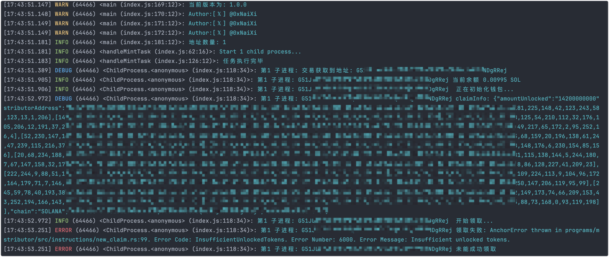
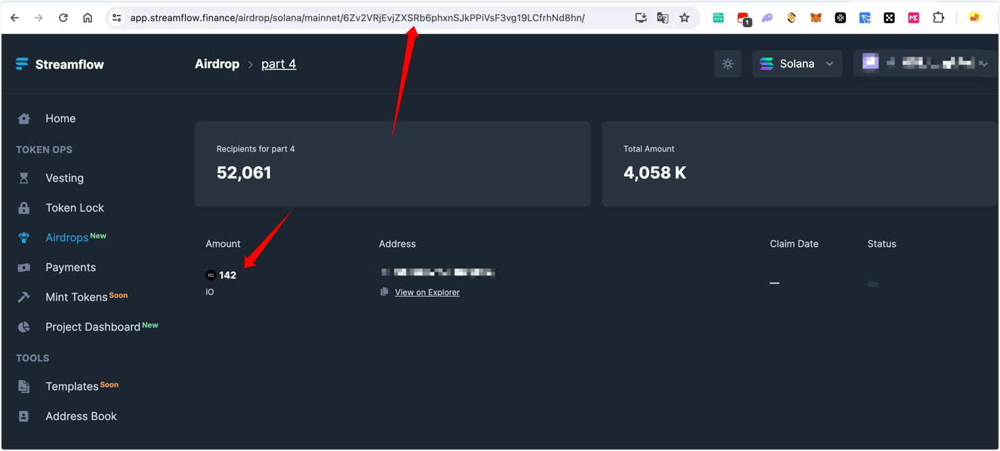

# ioClaimer 

ioClaimer 是一个专为 Solana 链上的 io 领取空头的工具，通过 ioClaimer 可以快速的领取空头。
网站 https://app.streamflow.finance/airdrop

## 运行截图



这里因为还没有开放领取,所以报错,应该是没有什么问题的,如果有问题,我再改

## 请我一杯咖啡

如果你觉得这个项目对你有帮助，可以请我喝一杯咖啡，谢谢！

SOL地址: EfDZm8wdkFU7JD8ACeWeJ54xaBVPWiZUKKmLSkN6WUzu

evm地址: 0xD70C7F06C07152Acb16D20012572250F57EEA624

## 安装

在项目根目录下，执行以下命令来安装项目依赖：

```bash
npm i
```

首先，您需要在 keys.txt 文件中输入相关的信息。请确保按照下面的格式添加您的信息（例如，地址、私钥等），一行一个：

```bash
地址----私钥
私钥
```

## 配置

在 .env 文件中，您可以配置以下参数：

```bash
# RPC_LIST rpc 列表 付多个rpc 使用 英文逗号分隔 如 https://mainnet-beta.solflare.network,https://cold-hanni-fast-mainnet.helius-rpc.com/
RPC_LIST=https://mainnet-beta.solflare.network
#线程数量
THREAD=10
# IO项目方代币分在了4个地址中，从链上看，是官方从主地址分发到下面4个地址里，如果你地址不在第一个查询入口的话，
# 就依次更换为下面3个链接，把你地址粘贴到“/”后面再次查询即可
# https://app.streamflow.finance/airdrop/solana/mainnet/DaxHHvEF5o5Jc1594zPbDNpG6mmjrmfW6kwWtT5J2qaS/
# https://app.streamflow.finance/airdrop/solana/mainnet/6Zv2VRjEvjZXSRb6phxnSJkPPiVsF3vg19LCfrhNd8hn/
# https://app.streamflow.finance/airdrop/solana/mainnet/7SxrF5GXTTfkPxdxfKGx2wuVtfGYrdaGjaqX3YFPf9sJ/
# https://app.streamflow.finance/airdrop/solana/mainnet/BPush3myMcgq1FbPs8f7JSZvieWA4bDbPinaZEatEEQ1/
# 例子为  https://app.streamflow.finance/airdrop/solana/mainnet/6Zv2VRjEvjZXSRb6phxnSJkPPiVsF3vg19LCfrhNd8hn/
# 选择属于你自己的分发地址
DISTRIBUTOR=6Zv2VRjEvjZXSRb6phxnSJkPPiVsF3vg19LCfrhNd8hn
# gas 优先费用 单位SOL
GASPRICE=0.0001
# gas 上限
GASLIMIT=200000
```

这里的重点是找到你自己的分发地址,然后填写到 DISTRIBUTOR 中 如下图的例子


## 运行

然后，运行以下命令来启动程序：

```bash
node index.js
```

## 说明

单账号单个进程同时运行,进程数量可以自己设置,默认为cpu核心数

